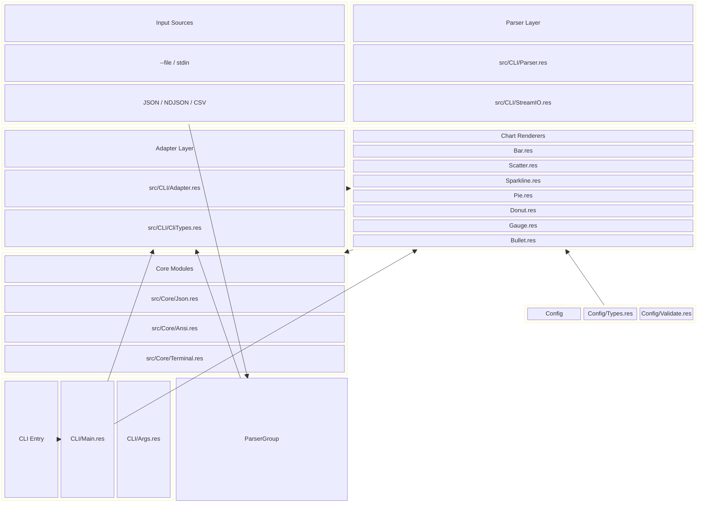
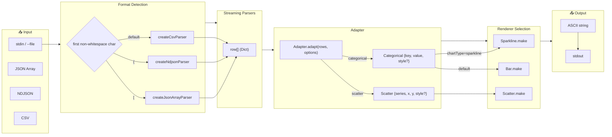
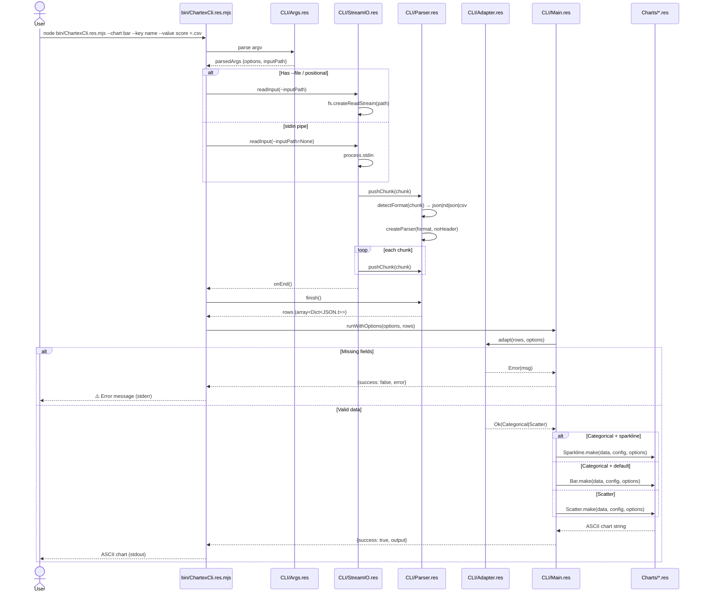
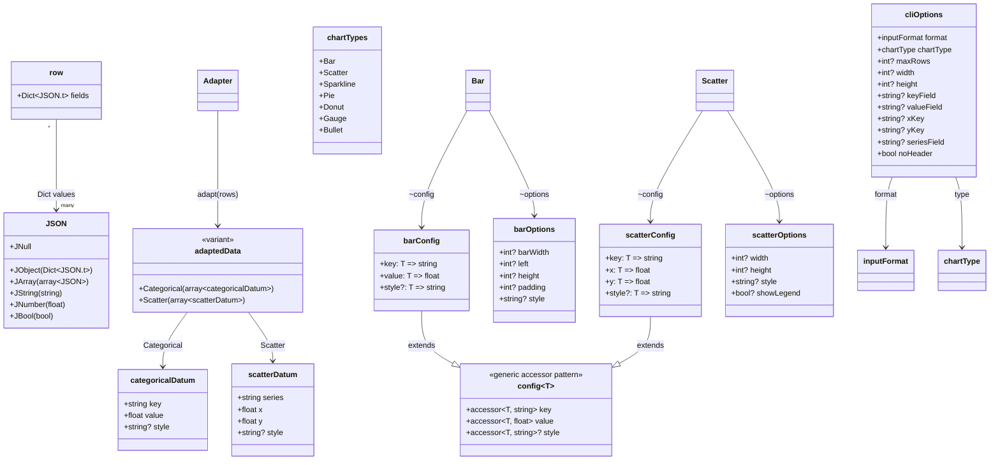
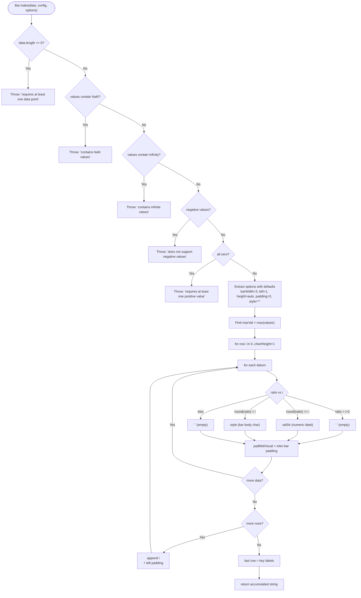
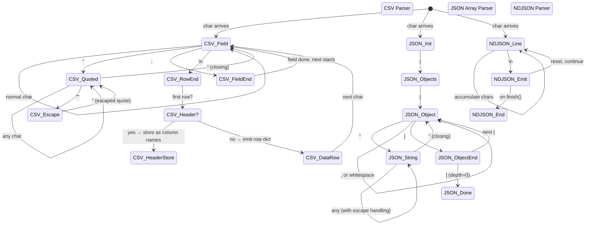

# chartex — Architecture, Control Flow & Product Requirements (PRD)

> Purpose: turn the architecture overview into a short Product Requirements Document (PRD) that documents goals, scope, constraints, acceptance criteria and an implementation roadmap alongside the technical diagrams.

## 0. Document Summary
- **What**: Architecture + control-flow diagrams for chartex, plus product context, functional and non-functional requirements, acceptance criteria, and an implementation roadmap.
- **Who is this for**: maintainers, contributors, reviewers and anyone evaluating a rebuild/adoption under Spec-Driven Development (SDD).
- **How to use**: Read Goals → Scope → Requirements to understand product intent; use the diagrams for technical onboarding; follow the Roadmap and Acceptance Criteria when implementing or validating changes.

## 1. Background & Motivation
chartex is a compact ReScript library and CLI that renders ASCII charts from JSON/NDJSON/CSV inputs. It aims to provide tiny, embeddable chart renderers for terminal scripts and pipelines. This PRD documents the core product goals and the technical system needed to achieve them.

## 2. Goals
Primary goals:
- Provide robust, tiny ASCII chart renderers (Bar, Scatter, Sparkline) that are easy to embed in scripts.
- Offer a simple CLI that pipes input → chart output with predictable field mapping and streaming parsing.
- Keep the library dependency-free and small; preserve ReScript core with TypeScript-compatible artifacts.

Secondary goals:
- Provide optional renderers (Pie, Donut, Gauge, Bullet) with consistent APIs.
- Maintain clear contracts and validations to make rebuild/adoption straightforward.

## 3. Success Metrics
- **Correctness**: Chart renderers handle typical inputs and report explicit errors on invalid inputs (NaN, infinite, negative values where unsupported).
- **Reliability**: CLI processes streaming input without crashing on common edge cases (quoted CSV, multi-line fields, NDJSON).
- **Size & dependency policy**: Remain zero-runtime-dependency for renderers; bundle size remains small enough for script embedding.
- **Developer ergonomics**: New contributors can find component responsibilities in < 30 minutes using these docs + diagrams.

## 4. Stakeholders
- **Maintainer**: @MetalbolicX
- **Users**: CLI users embedding charts in scripts; library consumers requiring tiny terminal visualizations
- **Contributors**: ReScript/TypeScript engineers who may rebuild or extend renderers

## 5. Scope
**Included (in-scope)**
- Core chart renderers: Bar, Scatter, Sparkline
- CLI pipeline, streaming parsers (csv/json/ndjson), Adapter layer mapping parsed rows to typed data
- Core modules (Json, Ansi, Terminal), Config/Types, validations and error messages
- Documentation, examples and CLI scripts in examples/

**Excluded (out-of-scope)**
- GUI/web-based visualization
- Automatic telemetry or usage analytics
- Rewriting to a different language/stack (unless explicitly chosen in roadmap)

## 6. Non-goals
- Not intended to be a full-featured charting library like matplotlib or D3.js
- Not intended to offer advanced interactivity in the terminal (this is static ASCII output)

## 7. Constraints & Assumptions
- Node >= 22 required (package.json declares this).
- ReScript is the source-of-truth; generated artifacts (res:build) are used for the CLI bundling.
- CLI runs in Unix-like environments and supports stdin and file streams.
- The repository is small; parallel agentization is optional.

## 8. Functional Requirements (High-level)
- **FR-1**: CLI must accept input as stdin or a file and support `--format {auto,json,ndjson,csv}`.
- **FR-2**: CLI must map fields using flags (`--key`, `--value`, `--x-key`, `--y-key`, `--series`).
- **FR-3**: Parser must support streaming CSV (with quoted fields), NDJSON, and JSON array input.
- **FR-4**: Adapter must convert parsed rows to typed adaptedData (Categorical/Scatter) with clear error messages when required fields are missing or have invalid types.
- **FR-5**: Each chart renderer must implement guarded validation for invalid data and return an ASCII string when successful.
- **FR-6**: Chart APIs must follow accessor pattern: config accessors for key/value/x/y and optional style accessor.
- **FR-7**: CLI must produce exit code or stderr on error conditions.

## 9. Non-Functional Requirements (NFR)
- **NFR-1**: The library must remain tiny — minimal runtime dependencies.
- **NFR-2**: Rendering performance must be suitable for small-medium data sets (hundreds of rows) and should stream parsing without buffering entire files unnecessarily.
- **NFR-3**: Determinism — given the same input and options, output must be identical between runs.
- **NFR-4**: Test coverage — critical paths (parsers, adapter, renderers) must be covered by unit tests.
- **NFR-5**: Error messages must be user-friendly and actionable (e.g., indicate missing fields, NaN or negative values when unsupported).

## 10. User Stories (examples)
- As a CLI user, I want to pipe NDJSON into chartex and receive a bar chart using `--key` and `--value` flags.
- As a script author, I want to import `Bar.make` from chartex and render a chart in my Node script.
- As a contributor, I want clear tests and PRD acceptance criteria so I can change renderer internals with confidence.

## 11. Acceptance Criteria
- **AC-1**: Parser handles multi-line quoted CSV fields, quoted double-quotes ("" escape), and emits correct column keys for header/no-header modes.
- **AC-2**: Adapter produces `Error(...)` messages for missing required fields and invalid types; those messages are displayed on stderr by the CLI.
- **AC-3**: `Bar.make` rejects negative values and NaN/Infinite values with explicit error messages (existing messages preserved).
- **AC-4**: `Scatter.make` assigns per-series styles and renders legend when `showLegend` is true.
- **AC-5**: CLI options map to the correct internal config objects (verify with unit tests).
- **AC-6**: Examples under `examples/` run successfully after `npm run cli:build` and produce expected outputs (smoke tests).

## 12. Roadmap & Milestones
- **M0** — PRD approval (this document)
- **M1** — Stabilize core: ensure tests for Parser, Adapter, Bar/Scatter/Sparkline
- **M2** — Documentation: extend docs/ with PRD summary, update README examples
- **M3** — Optional renderers: test & document Pie/Donut/Gauge/Bullet integration
- **M4** — Spec-driven rebuild (optional): create specs via reverse-spec and run /smart-sdd pipeline (depends on decision)

## 13. Risks & Mitigations
- **Risk**: Parser edge-cases (CSV quoting) cause silent data corruption.
  **Mitigation**: Add exhaustive tests for quoted CSV cases and increase parser fuzz tests.
- **Risk**: Rewriting or changing accessor contracts breaks downstream consumers.
  **Mitigation**: Keep accessor signatures stable; bump major version for breaking changes; provide migration docs.
- **Risk**: Runtime differences between ReScript compiled artifacts and TypeScript consumers.
  **Mitigation**: Keep ReScript API stable and generate TypeScript-friendly artifacts (already done via tsdown).

## 14. Operational Considerations
- CI: run `npm run res:build`, `npm run res:test`, `npm run cli:build` as part of CI pipeline.
- Build artifacts: `dist/` and `bin/` are produced by the build; ensure they are regenerated in release flows.

## 15. How to validate / QA checklist
- [ ] Unit tests for parse+adapter+render path pass.
- [ ] Smoke-run examples in `examples/` producing visually reasonable output.
- [ ] Run CLI with unusual inputs (empty, missing fields, NaN, negative) and verify error messages match expectations.

---

# Architecture & Control Flow (Diagrams)

## 1. High-Level Architecture

## 2. Data Flow Pipeline

## 3. CLI Execution Sequence

## 4. Type & Data Model Relationships

## 5. Chart Rendering Algorithm (Bar as example)

## 6. Parser State Machines

