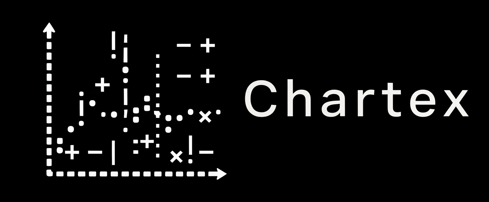

# chartex

<div align="center">
  
</div>

> `chartex` Making sense of data, one character at a time, on any screen.

**Supported Versions:**


## 🚀 Quick Installation

Add the required dependencies to your project:

```sh
npm i chartex
```

## 📊 Draw the First Chart

Here's a simple example of how to use `chartex`:

1. Create a file named `main.js`.
2. Add the following code to `main.js`:

```ts
import { renderBarChart } from "chartex";
const data = [
  { key: "A", value: 10, style: "#" },
  { key: "B", value: 20, style: "#" },
  { key: "C", value: 30, style: "#" },
];
const options = { width: 50, height: 10, style: "# " };
const chart = renderBarChart(data, options);
console.log(chart);
```

3. Run the application:

```sh
node main.js
```

## 📚 Documentation

<div align="center">

  [](https://metalbolicx.github.io/chartex/#/api-reference)

</div>

## Contributing

Contributions are welcome! Please feel free to submit a Pull Request.

## Technologies used

<table>
  <tr>
    <td align="center">
      <a href="https://www.typescriptlang.org/" target="_blank">
        <br/>
        <b>TypeScript</b><br/>
      </a>
    </td>
  </tr>
</table>

## License

Released under [MIT](/LICENSE) by [@MetalbolicX](https://github.com/MetalbolicX).
