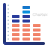
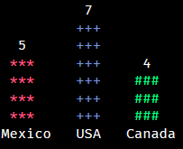
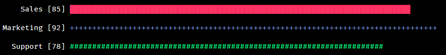
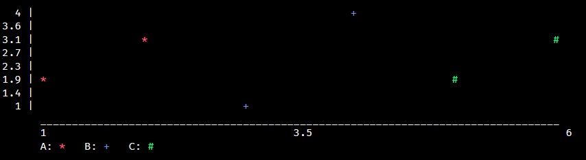
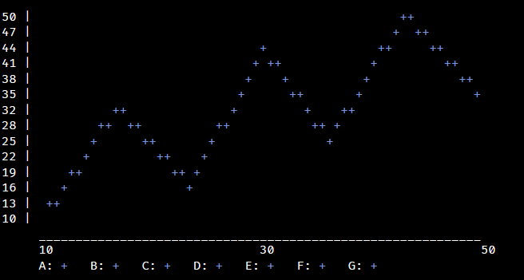
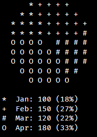

# chartex — ASCII charts for terminals and scripts

<div align="center">
  
</div>

> You don't need to leave the terminal to visualize your dataset.

<p align="center">
  <a href="https://www.npmjs.com/package/res-scrapy"></a>
  <a href="https://nodejs.org">=22.0.0-272e33?logo=node.js&logoColor=white" alt="Node.js"></a>
  
  
</p>

## Overview

`chartex` renders compact, beautiful ASCII charts from plain JSON/NDJSON/CSV input or a CLI. It is written in ReScript and shipped as a tiny ESM library so you can embed charts in scripts.

### Quick highlights

- Small, zero-dependency renderers: Bar, Bullet, Scatter, Sparkline, Pie/Donut/Gauge available in the library.
  - 
  - 
  - 
  - 
  - 
- Works with any data shape via accessor-based configs (no pre-transforms required).
- Includes an experimental CLI for piping data-in → ASCII chart-out.
- Thoroughly tested ReScript core with JavaScript-compatible build artifacts.

> [!NOTE]
> Requirements: Node.js 22+

## Quick Install

```sh
npm install chartex
```

## Usage

### Build your first chart with the library

1. Create a file `example.mjs` and paste:

```js
import { Bar } from "chartex";

const data = [
  { name: "Jan", total: 45 },
  { name: "Feb", total: 67 },
  { name: "Mar", total: 82 },
];

const chart = Bar.make(data, {
  key: (d) => d.name,
  value: (d) => d.total,
  style: (d) => (d.total > 60 ? "█" : "░"),
}, { height: 10 });

console.log(chart);
```

2. Run it:

```bash
node example.mjs
```

### CLI

You can install the CLI globally or use `npx` to run it without installing:

### Global install:

```sh
npm install -g chartex
```

### No-install usage:

Basic usage:

```bash
npx chartex [options] [file]
```

Options:

| Flag | Description |
|------|-------------|
| `--file, -f` | Input file path (alternative to positional `file`) |
| `--format` | Input format: `auto`, `json`, `ndjson`, `csv` (default: `auto`) |
| `--chart, -t` | Chart type: `auto`, `bar`, `scatter`, `sparkline` (default: `auto`) — note: the CLI currently renders Bar, Scatter and Sparkline charts only |
| `--width` | Chart width (columns) |
| `--height` | Chart height (rows) |
| `--max-rows` | Maximum parsed rows before failing |
| `--key` | Key field name for categorical data (default: `key`) |
| `--value` | Value field name for categorical data (default: `value`) |
| `--x-key` | X field name for scatter plots (default: `x`) |
| `--y-key` | Y field name for scatter plots (default: `y`) |
| `--series` | Series field name for scatter plots (default: `series`) |
| `--no-header` | Treat CSV as having no header row (default: false) |
| `--help, -h` | Show help text |
| `--version` | Show version number |

### Documentation

📖 **Full docs at [metalbolicx.github.io/chartex](https://metalbolicx.github.io/chartex/)**

- [API reference for library usage](https://metalbolicx.github.io/chartex/#/api-reference)
- [Examples and guides](https://metalbolicx.github.io/chartex/#/tutorials)

### Contributing

Contributions welcome — open issues or PRs. If you change ReScript sources, run:

```bash
npm run res:build   # compile ReScript
npm run res:test    # run tests
npm run cli:build   # bundle CLI (if needed)
```

## License

Released under [MIT](/LICENSE) by [@MetalbolicX](https://github.com/MetalbolicX).
