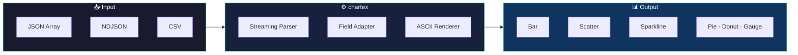

# chartex

Hey there! 👋

You're in the middle of a terminal session. You need to visualize some data — maybe API response times, CI/CD metrics, or sales numbers — and the last thing you want is to open a browser, spin up a web server, or fumble through a charting library that was built for the DOM.

Sound familiar?

That's the problem chartex solves.

## What Problem Does chartex Solve?

Visualizing data in terminals has always meant making trade-offs:

1. **Manual ASCII art** — you draw it once, it breaks the moment your data changes, and nobody else can reproduce it.
2. **termgraph** — only renders bar charts, only accepts TSV/CSV, and has no way to use it as a library.
3. **asciichart** — only renders line charts, expects a flat array of numbers, and has no CLI.
4. **gnuplot** — a full scientific plotting suite that needs a domain-specific language, a system package, and a separate pipeline to feed it data.

**The solution:** chartex is a zero-dependency library + CLI that turns JSON, NDJSON, or CSV into beautiful ASCII charts you can pipe anywhere — Node.js scripts, CI logs, shell dashboards, or direct terminal output.

---

## The Magic: JSON / NDJSON / CSV → chartex → ASCII Charts



Each stage is decoupled. Parsers handle format detection and streaming — no need to load a whole file into memory. The adapter maps fields by name so your data stays in its natural shape. Renderers produce pure ASCII strings that go anywhere a terminal can reach.

Two ways to use it:

```bash
# CLI — pipe data from any source
cat sales.ndjson | npx chartex --chart bar --key department --value revenue
```

```js
// Library — import and call directly in your scripts
import { Bar } from "chartex";
console.log(Bar.make(data, { key: (d) => d.name, value: (d) => d.total }));
```

---

## Why We Built It This Way

### Accessor Functions for Every Use Case

chartex works with **any data shape** because it never touches your objects directly — it asks you how to read them:

- **DevOps dashboards** — pipe JSON metrics → Bar chart of CPU/memory per host
- **CI/CD pipelines** — embed Sparkline in build logs for test duration trends across commits
- **Data exploration** — CSV → Scatter plot to spot correlations in seconds
- **Terminal UIs** — Donut/Pie for disk usage, Gauge for single-metric progress
- **Log analysis** — NDJSON logs → Bar chart of error counts by endpoint

### Why ReScript?

The library is written in ReScript and compiled to plain JavaScript. That choice passes these benefits directly to you:

- **Compile-time type safety** — generic accessor types catch wrong field accessors at build time, not at runtime
- **Zero runtime framework** — compiles to hand-equivalent JS; no classes, no prototypes, no runtime overhead
- **Tiny bundle** — 2,536 lines of source → 37.9 KB minified (all 7 chart types, all parsers, all utilities)
- **No null surprises** — the `option<T>` type means `undefined` never silently propagates through your chart data

---

## How Does It Compare?

| | chartex | termgraph | asciichart | gnuplot |
|---|---|---|---|---|
| Chart types | **7** (Bar, Bullet, Scatter, Sparkline, Pie, Donut, Gauge) | 1 (bar) | 1 (line) | Many |
| Input formats | JSON, NDJSON, CSV | TSV / CSV | Number arrays | Own DSL |
| Programmatic API | ✅ Library + CLI | CLI only | Library only | CLI + DSL |
| Multi-series support | ✅ Scatter, Sparkline | ❌ | ❌ | ✅ |
| Install footprint | ~38 KB | Small | Small | Large |
| Embeddable in Node.js | ✅ | ❌ | ✅ | ❌ |

Unlike termgraph and asciichart, chartex gives you 7 chart types with multi-series support and per-item conditional styling in a single package. Unlike gnuplot, it needs no DSL — just pass your data and accessor functions.

---

## Ready to Dive In?

- 🚀 **[Getting Started](getting-started.md)** — install chartex and render your first chart in under 2 minutes
- 📖 **[API Reference](api-reference.md)** — all 7 chart types, full config/options docs, and type signatures
- ⌨️ **[CLI Guide](cli.md)** — pipe data from stdin, files, or any source — full options reference
- 💡 **[Tutorials](tutorials.md)** — step-by-step examples: colors, conditional styling, sparklines, and scatter plots
- 🏗️ **[Architecture](architecture.md)** — PRD, data-flow diagrams, and the design decisions behind chartex

Let's start building! 🚀