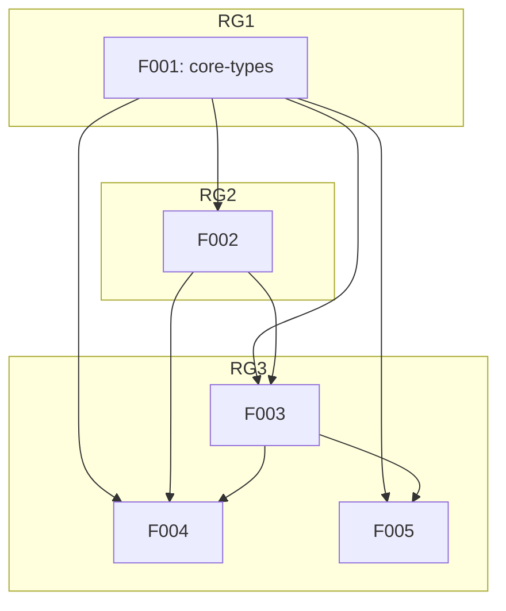

# chartex — Project Roadmap

> Generated by `/reverse-spec` — 2025-05-04

## Project Overview

**Project**: chartex  
**Type**: Library + CLI Tool (Terminal ASCII Data Visualization)  
**Source**: `/home/metalbolicx/Documents/chartex`  
**Stack**: ReScript → TypeScript  
**Scope**: Core (Tier 1 features only)

## Rebuild Strategy

**Stack Strategy**: Same Stack — use ReScript with TypeScript build output  
**Identity**: Same name (chartex)  
**Approach**: Incremental rebuild with Feature-by-Feature pipeline

## Feature Catalog (by Tier)

### Tier 1 — Essential

| ID | Feature | Description | Release Group | Dependencies |
|----|---------|-------------|---------------|--------------|
| F001 | core-types | Type definitions and validation for all chart configs | RG1 | None |
| F002 | terminal-utils | Terminal dimension detection, ANSI formatting, JSON parsing | RG2 | F001 |
| F003 | chart-rendering | ASCII chart algorithms (Bar, Pie, Donut, Gauge, Bullet, Sparkline, Scatter) | RG3 | F001, F002 |

### Tier 2 — Recommended

| ID | Feature | Description | Release Group | Dependencies |
|----|---------|-------------|---------------|--------------|
| F004 | cli-interface | CLI argument parsing, data adaptation, stream I/O | RG3 | F001, F002, F003 |

### Tier 3 — Optional

| ID | Feature | Description | Release Group | Dependencies |
|----|---------|-------------|---------------|--------------|
| F005 | bindings | External JavaScript/Node.js bindings | RG3 | F001, F003 |

## Dependency Graph

## Release Groups

| Release Group | Features | Description |
|---------------|----------|-------------|
| RG1 (Foundation) | F001-core-types | Type definitions — all other features depend on this |
| RG2 | F002-terminal-utils | Terminal utilities — needed for chart rendering |
| RG3 | F003-chart-rendering, F004-cli-interface, F005-bindings | Core implementation and extensions |

## Demo Groups

### DG-01: Library Usage
- **Scenario**: Use chartex as a library — import chart module, configure, render, get string output
- **Features**: F001-core-types, F002-terminal-utils, F003-chart-rendering
- **SBI Coverage**: B001–B021

### DG-02: CLI Usage
- **Scenario**: Use chartex from command line — parse args, read stdin/file, render chart, output to stdout
- **Features**: F001-core-types, F002-terminal-utils, F003-chart-rendering, F004-cli-interface
- **SBI Coverage**: B001–B032

## Cross-Feature Dependencies

### Shared Entities

| Entity | Owner Feature | Used By |
|--------|---------------|---------|
| backgroundColor type | F001-core-types | F002, F003 |
| barConfig/Options types | F001-core-types | F003 |
| pieConfig/Options types | F001-core-types | F003 |
| gaugeConfig/Options types | F001-core-types | F003 |
| bulletConfig/Options types | F001-core-types | F003 |
| sparklineConfig/Options types | F001-core-types | F003 |
| scatterConfig/Options types | F001-core-types | F003 |

### Shared APIs

| API | Owner Feature | Used By |
|-----|---------------|---------|
| Terminal.width/height | F002-terminal-utils | F003 |
| Ansi.bg/fg/cur* | F002-terminal-utils | F003, F004 |
| JSON.parse/stringify | F002-terminal-utils | F004 |

## Notes

- No HTTP API — this is a library/CLI, not a web service
- No Foundation framework detected — using custom approach
- Micro-scale project — simplified pipeline (Phase 1.5 skipped)